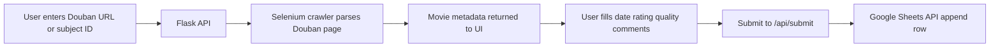
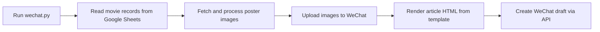

# Movie

A small Python app for managing movie logs from Douban.

It currently supports two workflows:

- Web app: parse movie info from a Douban subject ID/URL and append the result to Google Sheets
- WeChat script: read movie records from Google Sheets, build an article page, upload images, and save a draft to a WeChat Official Account

## Stack

- Python
- Flask
- Selenium
- Google Sheets API
- pywebview

## Project Structure

```text
.
|-- app.py                  # Flask entry
|-- desktop.py              # Desktop wrapper
|-- wechat.py               # WeChat draft workflow
|-- routes/                 # HTTP routes
|-- services/               # Business logic
|-- crawlers/               # Douban crawling
|-- utils/                  # Google Sheets helpers
|-- templates/              # Web and article templates
|-- static/                 # Frontend assets
`-- configs/                # Local config files
```

## Setup

1. Create and activate a virtual environment.
2. Install dependencies:

```bash
pip install -r requirements.txt
```

3. Make sure Chrome/Chromium and a matching ChromeDriver are available.
4. Put local config files in `configs/`.

## Config

This project reads local credentials from `configs/ids.json` by default.

Typical values used in the current code:

- Google Sheets IDs
- WeChat `AppID` / `AppSecret`
- Local draft data file at `configs/data.json`
- Google service account JSON file in `configs/`

Optional environment variables:

- `HOST`
- `PORT`
- `APP_RUN_MODE`
- `DRAFT_DATA_FILE`
- `CHROME_BIN`
- `CHROMEDRIVER_PATH`
- `GOOGLE_SERVICE_ACCOUNT_JSON`
- `GOOGLE_SERVICE_ACCOUNT_FILE`
- `SPREADSHEET_IDS_JSON`

## Run

Start the web app:

```bash
python app.py
```

Open `http://127.0.0.1:5000`.

Start the desktop wrapper:

```bash
python desktop.py
```

Run the WeChat draft flow:

```bash
python wechat.py
```

The script will prompt for a digest, read movie data from Google Sheets, generate article HTML, upload images, and create a WeChat draft.

## Workflows

### Web App Flow



### WeChat Draft Flow



## Docker

This repo includes a production-oriented [Dockerfile](c:/Users/Chris%20Yao/PycharmProjects/Movie/Dockerfile) for the Flask web app.

Build the image:

```bash
docker build -t movie .
```

Run the container:

```bash
docker run -p 8000:8000 movie
```

The container:

- installs Chromium and ChromeDriver
- uses `requirements-server.txt`
- starts the app with Gunicorn
- serves `wsgi:application` on port `8000`

## Azure Deployment

Inference from the current repo: the intended cloud deployment path is container-based deployment using the existing Docker image.

A simple Azure setup is:

1. Build and push the Docker image to a registry.
2. Create an Azure Web App for Containers / Azure App Service.
3. Point the app to the image.
4. Set required environment variables in Azure App Settings.
5. Mount or inject credentials securely instead of committing them to the image.

Recommended environment variables for Azure:

- `HOST=0.0.0.0`
- `PORT=8000`
- `APP_RUN_MODE=server`
- `DRAFT_DATA_FILE=/tmp/movie-data.json`
- `CHROME_BIN=/usr/bin/chromium`
- `CHROMEDRIVER_PATH=/usr/bin/chromedriver`
- `GOOGLE_SERVICE_ACCOUNT_JSON` or `GOOGLE_SERVICE_ACCOUNT_FILE`
- `SPREADSHEET_IDS_JSON`

Notes for Azure:

- The web app flow fits Azure App Service well.
- The `wechat.py` script is not part of the container startup path, so it is better treated as a manual/admin workflow unless you add a separate scheduled job.
- Keep `configs/` secrets out of the image and move them to Azure App Settings or another secret store.

## API

- `GET /` main page
- `GET /health` health check
- `POST /api/movie` fetch movie info from Douban
- `POST /api/submit` append a movie row to Google Sheets
- `GET /api/load` load local draft data
- `POST /api/save` save local draft data
- `POST /api/client-ping` desktop keep-alive

## Notes

- The crawler is built for Douban movie pages.
- `wechat.py` depends on valid WeChat Official Account credentials.
- Files in `configs/` should be treated as private.
