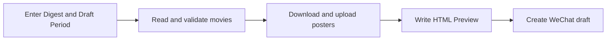

# WeChat Movie Draft

Create a WeChat Official Account movie draft from viewing records stored in Google Sheets.

A Draft Run reads and validates movies, uploads posters, generates an HTML preview, and creates one WeChat draft. This repository contains only the WeChat draft workflow.

## Workflow


```mermaid
flowchart LR
    A[Enter Digest and Draft Period] --> B[Read and validate movies]
    B --> C[Download and upload posters]
    C --> D[Write HTML Preview]
    D --> E[Create WeChat draft]
```

- Preserves Google Sheets row order.
- Shows the current movie and stage in the command window.
- Writes the Preview to `outputs/movie_wechat.html`.
- Stops before draft creation if a poster upload fails.
- Never modifies Google Sheets or `templates/movie_template.html`.

## Project Layout

```text
.
|-- wechat.py                         # Command-line entry point
|-- run_wechat.vbs                    # Windows launcher
|-- services/
|   |-- draft_selection.py            # Period and movie validation
|   |-- draft_workflow.py             # Draft Run coordinator
|   |-- poster_loader.py              # Poster download and compression
|   `-- wechat_client.py              # WeChat API client
|-- utils/google_sheets.py            # Read-only Google Sheets adapter
|-- templates/movie_template.html     # Source article template
`-- tests/                             # Offline tests
```

## Setup

```powershell
python -m venv .venv
.\.venv\Scripts\python.exe -m pip install -r requirements.txt
```

Create `configs/ids.json`:

```json
{
  "movie": "GOOGLE_SPREADSHEET_ID",
  "AppID": "WECHAT_APP_ID",
  "AppSecret": "WECHAT_APP_SECRET",
  "author": "ARTICLE_AUTHOR",
  "thumb_media_id": "WECHAT_THUMB_MEDIA_ID",
  "source_url": "https://example.com"
}
```
Google service account file can be obtained from [Google Developer Console](https://console.developers.google.com/).
Place the Google service account file under `configs/`.

Optional overrides:

| Variable | Purpose |
| --- | --- |
| `GOOGLE_SERVICE_ACCOUNT_JSON` | Complete service-account JSON string |
| `GOOGLE_SERVICE_ACCOUNT_FILE` | Service-account JSON file path |
| `SPREADSHEET_IDS_JSON` | JSON string containing spreadsheet IDs |

## Google Sheets Format

Each year uses a same-named sheet, such as `2026`.

| Field | Required | Notes |
| --- | --- | --- |
| `date` | Yes | `M/D` format |
| `name` | Yes | Movie title |
| `director` | Yes | Director display text |
| `year` | Yes | Release year |
| `rating` | Yes | Displayed rating |
| `comment` | Yes | May be empty |
| `movie_id` | Yes | Douban movie ID |
| `image_id` | Yes | Douban poster image ID |
| `quality` | No | Ignored |

## Run

Double-click `run_wechat.vbs`, or run:

```powershell
.\.venv\Scripts\python.exe wechat.py
```

Example input:

```text
Digest: Monthly movie notes
year: 2026
month: 6
```

Leave year or month blank to use the current value. Enter two months such as `6 7` to select a same-year range. An empty Digest is sent to WeChat as a single space.

Progress is shown in the command window:

```text
Selected 4 movies.
[1/4] Movie Name: downloading poster...
[1/4] Movie Name: uploading poster to WeChat...
Writing Preview to outputs\movie_wechat.html...
Creating WeChat draft...
Draft created: MEDIA_ID
```

If draft creation times out, inspect the WeChat backend before rerunning because the result is unknown.

## Tests

```powershell
.\.venv\Scripts\python.exe -m unittest discover -v
```

Tests use fake external adapters and do not create real drafts.
