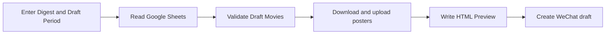

# WeChat Movie Draft

Create a WeChat Official Account movie article from viewing records stored in
Google Sheets.

One **Draft Run** performs the complete workflow: it selects and validates
movies, downloads and uploads posters, writes an HTML preview, and creates one
WeChat draft.

> This repository contains only the WeChat draft workflow. The former Web App
> has been removed.

## How It Works


```mermaid
flowchart LR
    A[Enter Digest and Draft Period] --> B[Read Google Sheets]
    B --> C[Validate Draft Movies]
    C --> D[Download and upload posters]
    D --> E[Write HTML Preview]
    E --> F[Create WeChat draft]
```

Key behavior:

- Select one month or a same-year range of two months.
- Validate the Google Sheet headers, dates, and required movie fields.
- Preserve the original Google Sheets row order.
- Show the current movie and stage in the command window.
- Overwrite `outputs/movie_wechat.html` on every Draft Run.
- Reuse one WeChat access token for poster uploads and draft creation.
- Stop before draft creation if any poster upload fails.
- Never modify Google Sheets or `templates/movie_template.html`.

## Project Layout

```text
.
|-- wechat.py                         # Command-line entry point
|-- run_wechat.vbs                    # Double-click Windows launcher
|-- services/
|   |-- draft_selection.py            # Draft Period and Draft Movie validation
|   |-- draft_workflow.py             # End-to-end Draft Run coordinator
|   |-- poster_loader.py              # Douban poster download and compression
|   |-- wechat_client.py              # WeChat API client
|   `-- wechat_service.py             # Compatibility helpers
|-- utils/
|   `-- google_sheets.py              # Read-only Google Sheets adapter
|-- templates/
|   `-- movie_template.html           # Source article template
|-- outputs/
|   `-- movie_wechat.html             # Generated Preview, ignored by Git
`-- tests/                             # Offline automated tests
```

## Requirements

- Python 3.11 or later
- A Google service account with read access to the movie spreadsheet
- A WeChat Official Account with draft and image-upload API access

Create a virtual environment and install dependencies:

```powershell
python -m venv .venv
.\.venv\Scripts\python.exe -m pip install -r requirements.txt
```

## Configuration

### WeChat And Spreadsheet IDs

Create `configs/ids.json`:

```json
{
  "movie": "GOOGLE_SPREADSHEET_ID",
  "AppID": "WECHAT_APP_ID",
  "AppSecret": "WECHAT_APP_SECRET",
  "author": "ARTICLE_AUTHOR",
  "thumb_media_id": "WECHAT_THUMB_MEDIA_ID",
  "source_url": "https://example.com"
}
```

All values are required. The `movie` value identifies the Google spreadsheet.
The remaining values configure WeChat authentication and article defaults.

### Google Service Account

The default credentials path is:

```text
configs/movie-491021-1cd922995007.json
```

The following environment variables can override local configuration:

| Variable | Purpose |
| --- | --- |
| `GOOGLE_SERVICE_ACCOUNT_JSON` | Complete service-account JSON string |
| `GOOGLE_SERVICE_ACCOUNT_FILE` | Path to a service-account JSON file |
| `SPREADSHEET_IDS_JSON` | JSON string containing spreadsheet IDs |

### Google Sheets Format

Each year uses a same-named sheet, such as `2026`. Draft Movies require these
headers:

| Field | Required | Notes |
| --- | --- | --- |
| `date` | Yes | `M/D` format, for example `6/9` |
| `name` | Yes | May contain a primary and foreign-language title |
| `director` | Yes | Director display text |
| `year` | Yes | Movie release year |
| `rating` | Yes | Displayed rating |
| `comment` | Yes | May be an empty string |
| `movie_id` | Yes | Douban movie ID |
| `image_id` | Yes | Douban poster image ID |
| `quality` | No | Ignored by Draft Runs |

## Run

### Windows Launcher

Double-click:

```text
run_wechat.vbs
```

### Command Line

```powershell
.\.venv\Scripts\python.exe wechat.py
```

The command prompts for:

```text
Digest: Monthly movie notes
year: 2026
month: 6
```

Draft Period input:

| Input | Result |
| --- | --- |
| Blank year | Current year |
| Blank month | Current month |
| `6` | June |
| `6 7` | June through July |

An empty Digest is sent to WeChat as a single space to preserve the established
API behavior.

## Progress Output

The command window reports each major stage and the current movie:

```text
Reading Google Sheets for <generated draft title>...
Selected 4 movies.
[1/4] Movie Name: downloading poster...
[1/4] Movie Name: uploading poster to WeChat...
[1/4] Movie Name: poster uploaded.
Writing Preview to outputs\movie_wechat.html...
Creating WeChat draft...
Draft created: MEDIA_ID
Completed in 35.2s
```

After a successful Draft Run:

- `outputs/movie_wechat.html` contains the generated Preview.
- The WeChat Official Account backend contains one new draft.
- The command window displays the returned WeChat `media_id`.

## Failure And Recovery

| Situation | Behavior |
| --- | --- |
| Invalid Draft Period | Stops immediately with a clear error |
| No movies in the Draft Period | Stops before downloading or uploading posters |
| Missing required movie fields | Reports the Google Sheet row and missing fields |
| Poster download or upload failure | Stops before draft creation; reruns start from the first poster |
| WeChat business error | Displays the complete response returned by WeChat |
| Draft creation timeout | Result is unknown; inspect WeChat before rerunning |

Draft Runs do not cache upload progress or create local Google Sheets backups.

## Tests

Run the complete offline test suite:

```powershell
.\.venv\Scripts\python.exe -m unittest discover -v
```

Automated tests use fake Google Sheets, Douban, and WeChat adapters. They do not
call real external APIs or create real drafts.

## Documentation

- [Domain language and workflow rules](CONTEXT.md)
- [Completed refactor checklist](docs/wechat-draft-refactor-checklist.md)
